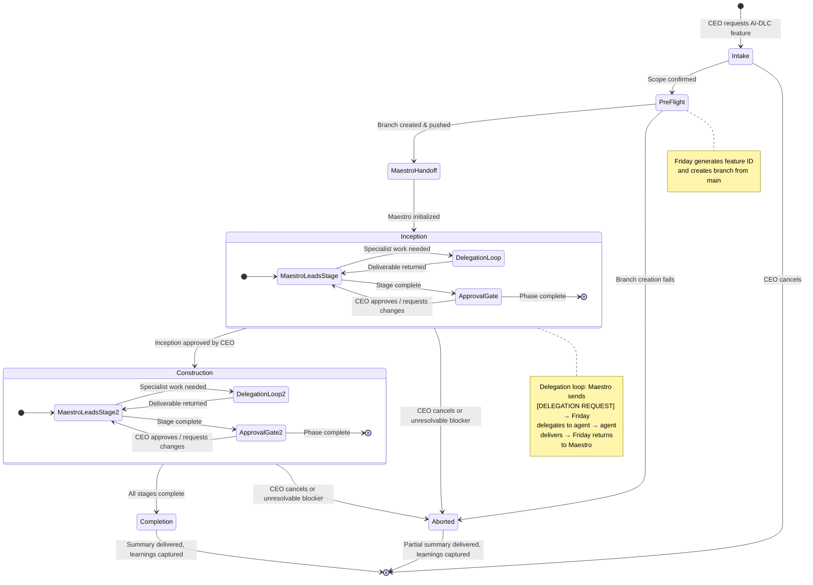

# Friday — Workflows

This file catalogs the named workflows Friday can orchestrate. Each workflow defines its trigger conditions, participating agents, states, guidelines, and a flow diagram.

For how Friday executes any workflow generically (Command Intake, Reconnaissance, Planning, Delegation, Reporting, Escalation, Learning Capture), see `methodology.md`.

---

## 1. Feature Development (AI-DLC)

### Trigger

CEO requests a feature built using the AI-DLC methodology (e.g., "build feature X using AI-DLC").

### Participating Agents

- **Maestro** (AI-DLC Conductor) — owns process orchestration, stage ordering, artifact generation, and approval gates.
- **Nexus** (Product Architect), **Atlas** (Technical Architect), **Forge** (Backend), **Pixel** (Web Frontend), **Dart** (Mobile), **Sentinel** (Code Reviewer), **Echo** (QA) — invoked as needed per Maestro's delegation requests.

### States

```
Intake → Pre-Flight → Maestro Handoff → Inception → Construction → Completion
                                                                  ↘ Aborted
```

| # | State | Owner | Description |
|---|-------|-------|-------------|
| 1 | **Intake** | Friday | Parse the CEO's request, clarify scope and constraints, confirm AI-DLC is the desired workflow. |
| 2 | **Pre-Flight** | Friday | Determine feature ID (`FEAT-[YYYYMMDD]-[short-slug]` or CEO-provided), create feature branch (`feature/[feature_ID]_[shortName]`) from `main`, push to remote. |
| 3 | **Maestro Handoff** | Friday | Invoke Maestro with branch context and feature scope. Maestro loads AI-DLC rules and initializes `aidlc-state.md` and `audit.md`. |
| 4 | **Inception** | Maestro | Maestro drives Inception stages (requirements, stories, design, planning). Sends `[DELEGATION REQUEST]`s back to Friday for Nexus/Atlas work. Friday relays approval gates to CEO and returns CEO decisions to Maestro. |
| 5 | **Construction** | Maestro | Maestro drives Construction stages (functional design, NFRs, code planning, implementation, review, testing). Sends `[DELEGATION REQUEST]`s back to Friday for Atlas/Forge/Pixel/Dart/Sentinel/Echo work. Friday relays approval gates to CEO. |
| 6 | **Completion** | Friday | Maestro signals workflow complete. Friday presents final summary to CEO, captures learnings in `learnings.md`, and closes out the workflow. |
| 7 | **Aborted** | Friday | CEO cancels the workflow, or a critical blocker cannot be resolved after escalation. Friday records what was completed and why the workflow stopped. |

> **Future state:** Operations (Maestro-led) — deployment, monitoring, and feedback loops. Placeholder per AI-DLC methodology; will be added when operational workflows are defined.

### Guidelines

- **Friday owns pre-Maestro work:** Branch creation, feature ID generation, and initial scope clarification happen before Maestro is invoked.
- **Maestro owns process orchestration:** Stage ordering, conditional stage assessment, artifact generation, and approval gate presentation are Maestro's responsibility.
- **Friday is the message relay:** All communication between Maestro and specialist agents flows through Friday. All communication between Maestro and the CEO flows through Friday.
- **Single-instance rule:** Only one Maestro may run at a time. If a previous AI-DLC workflow is in progress, check `aidlc-state.md` for resumption.
- **[STUCK] handling:** If Maestro sends `[STUCK]`, Friday attempts the task once (if within competency), then escalates to the CEO.
- **Approval gates are blocking:** Friday must relay CEO approval before Maestro can proceed past any gate. Never auto-approve.
- **Learning capture:** After Completion (or Abort), Friday records patterns, preferences, and pitfalls in `learnings.md`.

### Flow Diagram


