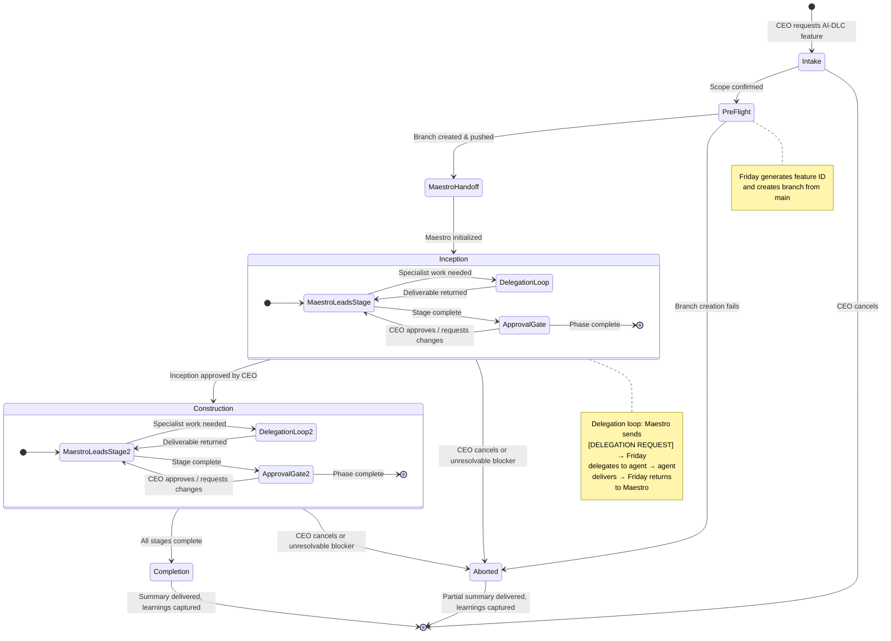

# Friday — Workflows

This file catalogs the named workflows Friday can orchestrate. Each workflow defines its trigger conditions, participating agents, states, guidelines, and a flow diagram.

For how Friday executes any workflow generically (Command Intake, Reconnaissance, Planning, Delegation, Reporting, Escalation, Learning Capture), see `methodology.md`.

---

## 1. Feature Development (AI-DLC)

### Trigger

CEO requests a feature built using the AI-DLC methodology (e.g., "build feature X using AI-DLC").

### Participating Agents

- **Maestro** (AI-DLC Conductor) — owns process orchestration, stage ordering, artifact generation, and approval gates.
- **Nexus** (Product Architect), **Atlas** (Technical Architect), **Forge** (Backend), **Pixel** (Web Frontend), **Dart** (Mobile), **Sentinel** (Code Reviewer), **Echo** (QA) — invoked as needed per Maestro's delegation requests.

### States

```
Intake → Pre-Flight → Maestro Handoff → Inception → Construction → Completion
                                                                  ↘ Aborted
```

| # | State | Owner | Description |
|---|-------|-------|-------------|
| 1 | **Intake** | Friday | Parse the CEO's request, clarify scope and constraints, confirm AI-DLC is the desired workflow. |
| 2 | **Pre-Flight** | Friday | Determine feature ID (`FEAT-[YYYYMMDD]-[short-slug]` or CEO-provided), create feature branch (`feature/[feature_ID]_[shortName]`) from `main`, push to remote. |
| 3 | **Maestro Handoff** | Friday | Invoke Maestro with branch context and feature scope. Maestro loads AI-DLC rules and initializes `aidlc-state.md` and `audit.md`. |
| 4 | **Inception** | Maestro | Maestro drives Inception stages (requirements, stories, design, planning). Sends `[DELEGATION REQUEST]`s back to Friday for Nexus/Atlas work. Friday relays approval gates to CEO and returns CEO decisions to Maestro. |
| 5 | **Construction** | Maestro | Maestro drives Construction stages (functional design, NFRs, code planning, implementation, review, testing). Sends `[DELEGATION REQUEST]`s back to Friday for Atlas/Forge/Pixel/Dart/Sentinel/Echo work. Friday relays approval gates to CEO. |
| 6 | **Completion** | Friday | Maestro signals workflow complete. Friday presents final summary to CEO, captures learnings in `learnings.md`, and closes out the workflow. |
| 7 | **Aborted** | Friday | CEO cancels the workflow, or a critical blocker cannot be resolved after escalation. Friday records what was completed and why the workflow stopped. |

> **Future state:** Operations (Maestro-led) — deployment, monitoring, and feedback loops. Placeholder per AI-DLC methodology; will be added when operational workflows are defined.

### Guidelines

- **Friday owns pre-Maestro work:** Branch creation, feature ID generation, and initial scope clarification happen before Maestro is invoked.
- **Maestro owns process orchestration:** Stage ordering, conditional stage assessment, artifact generation, and approval gate presentation are Maestro's responsibility.
- **Friday relays CEO communication:** All communication between Maestro and the CEO flows through Friday. Maestro may invoke specialist agents directly for stage-specific work without Friday relaying each request. Friday tracks delegation outcomes for status reporting.
- **Single-instance rule:** Only one Maestro may run at a time. If a previous AI-DLC workflow is in progress, check `aidlc-state.md` for resumption.
- **[STUCK] handling:** If Maestro sends `[STUCK]`, Friday attempts the task once (if within competency), then escalates to the CEO.
- **Approval gates are blocking:** Friday must relay CEO approval before Maestro can proceed past any gate. Never auto-approve.
- **Learning capture:** After Completion (or Abort), Friday records patterns, preferences, and pitfalls in `learnings.md`.

### Flow Diagram



---

## 2. Code Review Cycle

### Trigger

A coding agent (Forge, Pixel, or Dart) opens a PR on GitHub after completing implementation.

### Participating Agents (Default — Solo Developer)

- **Sentinel** (Code Reviewer) — reviews the PR, approves or leaves comments with fix guidance.
- **Forge / Pixel / Dart** (original coding agent) — addresses review comments, pushes fixes.

For team settings or high-risk changes, Atlas may be added as a comment triage layer (see `shared/code_review_flow.md` section 3).

### Reference

Full flow definition: `shared/code_review_flow.md`.

### Flow

```
PR Opened → Sentinel Reviews → Approved (clean pass)
                              → Comments Left → Coding Agent Fixes → Sentinel Re-Reviews (cycle)
```

### Guidelines

- **GitHub is the source of truth:** PR status is tracked via GitHub, not a `pull_requests.md` file.
- **Sequential processing:** Review one PR at a time. Do not start reviewing the next PR until the current one is approved.
- **Single-instance rule applies:** If Sentinel is busy, the review waits.
- **Friday invokes Sentinel** when a PR is ready for review and surfaces escalations (`[SECURITY_ALERT]`, `[STUCK]`) to the CEO immediately.
- **`[STUCK]` rule:** After 2 failed fix attempts, coding agent escalates to Friday.
- **Learning capture:** After a review cycle completes, note any recurring patterns in `learnings.md`.

---

## 3. Feature Retrospective

### Trigger

A feature workflow reaches the **Completion** state (Workflow 1) — either successful completion or abort. The CEO may also explicitly request a retrospective at any time.

### Participating Agents

- **Friday** (owns the retrospective) — collects learnings, identifies patterns, proposes rule changes.

### States

```
Collect → Analyze → Propose → Record
```

| # | State | Owner | Description |
|---|-------|-------|-------------|
| 1 | **Collect** | Friday | Read all agent `learnings.md` files that were updated during the feature. |
| 2 | **Analyze** | Friday | Identify recurring patterns, process gaps, and methodology friction points across all agents. |
| 3 | **Propose** | Friday | Present a summary to the CEO with specific, actionable recommendations for rule changes. |
| 4 | **Record** | Friday | Update `agents/ceo-assistant/learnings.md` with the retrospective findings. Apply CEO-approved rule changes to the relevant files. |

### Retrospective Checklist

Friday reviews:
- [ ] All agent `learnings.md` files for entries added during this feature
- [ ] Were all process gates followed (branching, tests, PRs, review)?
- [ ] Were there any `[STUCK]` escalations? What caused them?
- [ ] Were approval gates streamlined or did they cause friction?
- [ ] Did context window exhaustion cause rule-dropping or shortcuts?
- [ ] Were there any delegation failures (agent invocation issues, missing context)?
- [ ] Is any methodology rule consistently violated? Should it be simplified or removed?

### Output Format

Present to CEO:

```markdown
## Feature Retrospective: [Feature Name]

### What Worked
- [pattern that should be reinforced]

### What Didn't Work
- [pattern that should be changed]

### Proposed Rule Changes
1. [Specific change] — [file to modify] — [rationale]
2. [Specific change] — [file to modify] — [rationale]

### Agent-Specific Notes
- [Agent]: [observation]
```

### Guidelines

- **Run after every feature**, not just failures. Successful features reveal good patterns worth reinforcing.
- **Keep it lightweight:** 5-10 minutes, not a full audit. Focus on actionable changes.
- **Close the loop:** If a rule change is approved, apply it immediately — don't just log it for later.
- **Cross-reference:** Check if the same issue appeared in previous retrospectives. Recurring issues indicate structural problems, not one-off mistakes.
