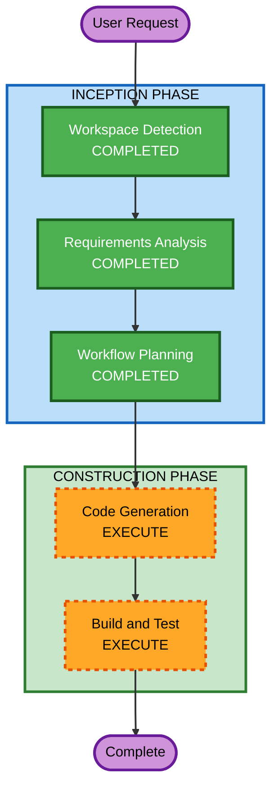

# Execution Plan — AppView Route Restructure

## Detailed Analysis Summary

### Transformation Scope
- **Transformation Type**: Architectural restructure (route reorganization)
- **Primary Changes**: Route hierarchy restructure in pulse-web, URL updates in pulse-app
- **Related Components**: Next.js App Router pages, layouts, Flutter WebView configuration

### Change Impact Assessment
- **User-facing changes**: No — pages render identically, just at new URLs
- **Structural changes**: Yes — route hierarchy moves from flat to nested `/appview/*`
- **Data model changes**: No — no database or model changes
- **API changes**: No — no backend API changes
- **NFR impact**: No — no performance, security, or scalability changes

### Component Relationships
- **Primary Component**: pulse-web `src/app/` (route structure)
- **Dependent Component**: pulse-app `lib/features/webview/pulse_webview.dart` (WebView URL)
- **Shared Components**: `src/components/`, `src/lib/` — unchanged, shared by both route groups
- **Change Priority**: pulse-web first (routes exist), then pulse-app (URL references)

### Risk Assessment
- **Risk Level**: Low — isolated route moves, easy rollback, well-understood Next.js patterns
- **Rollback Complexity**: Easy — revert file moves and URL changes
- **Testing Complexity**: Simple — verify routes render, build passes, Flutter loads correctly

---

## Workflow Visualization



### Text Alternative

```
INCEPTION PHASE:
  1. Workspace Detection     — COMPLETED
  2. Reverse Engineering     — SKIPPED (existing knowledge sufficient)
  3. Requirements Analysis   — COMPLETED
  4. User Stories             — SKIPPED
  5. Workflow Planning        — COMPLETED
  6. Application Design      — SKIPPED
  7. Units Generation        — SKIPPED

CONSTRUCTION PHASE:
  8. Functional Design       — SKIPPED
  9. NFR Requirements        — SKIPPED
 10. NFR Design              — SKIPPED
 11. Infrastructure Design   — SKIPPED
 12. Code Generation         — EXECUTE
 13. Build and Test          — EXECUTE
```

---

## Phases to Execute

### INCEPTION PHASE
- [x] Workspace Detection (COMPLETED)
- [x] Reverse Engineering — SKIPPED
  - **Rationale**: Existing codebase knowledge from localization feature and current exploration is sufficient
- [x] Requirements Analysis (COMPLETED)
- [x] User Stories — SKIPPED
  - **Rationale**: Internal refactoring with no user-facing behavior changes; no new user interactions or personas
- [x] Workflow Planning (IN PROGRESS)
- [x] Application Design — SKIPPED
  - **Rationale**: No new components or services; existing components are being moved, not redesigned
- [x] Units Generation — SKIPPED
  - **Rationale**: Single cohesive unit of work; pulse-web route restructure + pulse-app URL update are tightly coupled and sequential

### CONSTRUCTION PHASE
- [ ] Functional Design — SKIPPED
  - **Rationale**: No new business logic; pages retain identical functionality
- [ ] NFR Requirements — SKIPPED
  - **Rationale**: No new NFR concerns; existing NFR baseline unchanged
- [ ] NFR Design — SKIPPED
  - **Rationale**: NFR Requirements skipped
- [ ] Infrastructure Design — SKIPPED
  - **Rationale**: No infrastructure changes; same deployment model
- [ ] Code Generation — EXECUTE (ALWAYS)
  - **Rationale**: Implementation of route restructure across pulse-web and pulse-app
- [ ] Build and Test — EXECUTE (ALWAYS)
  - **Rationale**: Verify builds pass, tests pass, and routes work correctly

### OPERATIONS PHASE
- [ ] Operations — PLACEHOLDER

---

## Module Update Strategy
- **Update Approach**: Sequential (pulse-web first, then pulse-app)
- **Critical Path**: pulse-web route restructure must complete before pulse-app URL update
- **Coordination Points**: WebView URL in pulse-app must match new route structure in pulse-web
- **Testing Checkpoints**: Build verification after pulse-web changes, then after pulse-app changes

## Construction Prerequisites Checklist
- [x] Technology Stack Documented — Brownfield, existing tech stack known (Next.js 16, Flutter)
- [x] NFR Baseline Defined — requirements.md includes NFR targets
- [x] Application Design — SKIPPED (not needed)
- [x] Units Generation — SKIPPED (single unit)

## Success Criteria
- **Primary Goal**: Clear route segregation between app-shell pages (`/appview/*`) and browser pages (root level)
- **Key Deliverables**: Restructured pulse-web routes, updated pulse-app WebView URL, passing builds
- **Quality Gates**: `npm run build`, `npx tsc --noEmit`, `npm run lint`, `flutter analyze`
