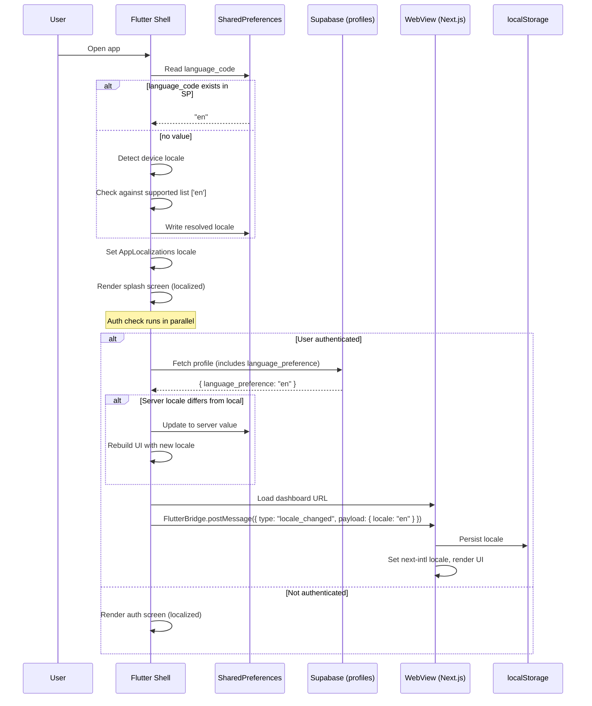
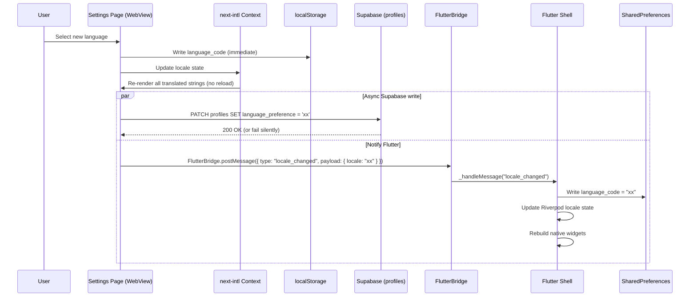
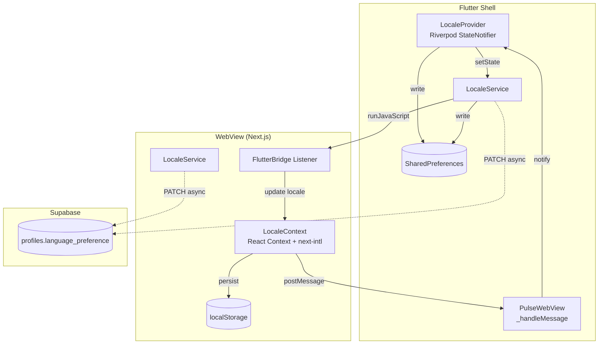

# Application Design Document: Localization (i18n) Infrastructure -- v1

**Feature:** Globalization & Persistent Localization
**Author:** Atlas (Technical Architect)
**Date:** 2026-02-21
**Status:** Draft
**Source Requirements:** `aidlc-docs/inception/requirements/requirements.md`

---

## 1. Component Architecture

### 1.1 pulse-web (Next.js) -- New Components & Services

| Component / Module | Type | Location | Purpose |
|---|---|---|---|
| `i18n/request.ts` | Config | `src/i18n/request.ts` | `next-intl` request-scoped configuration -- resolves active locale, loads messages |
| `i18n/config.ts` | Config | `src/i18n/config.ts` | Central locale registry: supported locales list, default locale, locale metadata |
| `i18n/locale-context.tsx` | Client Provider | `src/i18n/locale-context.tsx` | React context wrapping `next-intl`'s provider with locale persistence (localStorage read/write) and FlutterBridge listener |
| `messages/en.json` | Data | `src/messages/en.json` | English translation file -- all UI strings organized by feature namespace |
| `app/settings/page.tsx` | Page | `src/app/settings/page.tsx` | New `/settings` route -- server component shell |
| `components/settings/settings-page.tsx` | Client Component | `src/components/settings/settings-page.tsx` | Settings page layout with language section |
| `components/settings/language-selector.tsx` | Client Component | `src/components/settings/language-selector.tsx` | Language picker -- displays options in native names, triggers locale switch |
| `lib/services/locale-service.ts` | Service | `src/lib/services/locale-service.ts` | Supabase `language_preference` read/write, localStorage persistence |

### 1.2 pulse-app (Flutter) -- New Components & Services

| Component / Module | Type | Location | Purpose |
|---|---|---|---|
| `l10n.yaml` | Config | `pulse-app/l10n.yaml` | Flutter l10n codegen configuration |
| `lib/l10n/app_en.arb` | Data | `pulse-app/lib/l10n/app_en.arb` | English ARB translation file |
| `lib/core/services/locale_service.dart` | Service | `pulse-app/lib/core/services/locale_service.dart` | Locale resolution, SharedPreferences persistence, Supabase sync |
| `lib/core/providers/locale_provider.dart` | State | `pulse-app/lib/core/providers/locale_provider.dart` | Riverpod `StateNotifierProvider` for reactive locale state |

### 1.3 pulse-supabase -- New Migration

| File | Purpose |
|---|---|
| `YYYYMMDDHHMMSS_add_language_preference.sql` | Add `language_preference TEXT NOT NULL DEFAULT 'en'` to `profiles` table |

---

## 2. Data Flow Diagrams

### 2.1 Bootstrapping Flow (App Launch to UI Render)



### 2.2 Language Switch Flow (User Changes Language in Settings)



### 2.3 Cross-Layer Sync Flow (Flutter to WebView and Back)



---

## 3. File Structure

### 3.1 pulse-web -- New and Modified Files

```
pulse-web/
├── src/
│   ├── i18n/
│   │   ├── config.ts                  # NEW: Locale registry + metadata
│   │   ├── request.ts                 # NEW: next-intl getRequestConfig
│   │   └── locale-context.tsx         # NEW: Client-side locale provider + bridge listener
│   ├── messages/
│   │   └── en.json                    # NEW: English translations (all namespaces)
│   ├── app/
│   │   ├── layout.tsx                 # MODIFIED: Wrap with NextIntlClientProvider, dynamic lang attr
│   │   ├── settings/
│   │   │   └── page.tsx               # NEW: Settings route (server component shell)
│   │   ├── dashboard/
│   │   │   └── page.tsx               # MODIFIED: Pass locale-aware props
│   │   ├── connections/
│   │   │   └── page.tsx               # MODIFIED: Replace hardcoded strings with t()
│   │   ├── profile-setup/
│   │   │   └── page.tsx               # MODIFIED: Replace hardcoded strings with t()
│   │   └── auth/
│   │       └── error/
│   │           └── page.tsx           # MODIFIED: Replace hardcoded strings with t()
│   ├── components/
│   │   ├── settings/
│   │   │   ├── settings-page.tsx      # NEW: Settings layout component
│   │   │   └── language-selector.tsx  # NEW: Language picker component
│   │   ├── dashboard/
│   │   │   ├── dashboard-content.tsx  # MODIFIED: useTranslations() for all strings
│   │   │   ├── status-card.tsx        # MODIFIED: useTranslations()
│   │   │   ├── connection-card.tsx    # MODIFIED: useTranslations()
│   │   │   ├── connection-grid.tsx    # MODIFIED: useTranslations()
│   │   │   ├── empty-connections-view.tsx # MODIFIED: useTranslations()
│   │   │   └── wisdom-card.tsx        # MODIFIED: useTranslations() (dismiss hint only; wisdom text stays hardcoded)
│   │   └── connections/
│   │       ├── connection-grid.tsx    # MODIFIED: useTranslations()
│   │       ├── connection-card.tsx    # MODIFIED: useTranslations()
│   │       ├── empty-connections-view.tsx # MODIFIED: useTranslations()
│   │       └── invite-modal.tsx       # MODIFIED: useTranslations()
│   └── lib/
│       └── services/
│           └── locale-service.ts      # NEW: localStorage + Supabase persistence
├── next.config.ts                     # MODIFIED: Add next-intl plugin
└── package.json                       # MODIFIED: Add next-intl dependency
```

### 3.2 pulse-app -- New and Modified Files

```
pulse-app/
├── l10n.yaml                                 # NEW: Flutter l10n codegen config
├── pubspec.yaml                              # MODIFIED: Add flutter_localizations, intl, shared_preferences
├── lib/
│   ├── l10n/
│   │   └── app_en.arb                        # NEW: English ARB translations
│   ├── core/
│   │   ├── services/
│   │   │   └── locale_service.dart           # NEW: Locale resolution + persistence
│   │   └── providers/
│   │       └── locale_provider.dart          # NEW: Riverpod locale StateNotifier
│   ├── main.dart                             # MODIFIED: Add localizationsDelegates, supportedLocales, locale from provider
│   └── features/
│       ├── auth/
│       │   ├── auth_screen.dart              # MODIFIED: Replace hardcoded strings with AppLocalizations
│       │   └── widgets/
│       │       └── auth_button.dart          # MODIFIED: Accept localized label
│       ├── profile/
│       │   └── profile_setup_screen.dart     # MODIFIED: Replace hardcoded strings
│       ├── splash/
│       │   └── splash_screen.dart            # MODIFIED: Replace hardcoded strings, trigger locale bootstrap
│       └── webview/
│           └── pulse_webview.dart            # MODIFIED: Handle locale_changed messages (send + receive)
```

### 3.3 pulse-supabase -- New File

```
pulse-supabase/
└── supabase/
    └── migrations/
        └── YYYYMMDDHHMMSS_add_language_preference.sql   # NEW
```

**Migration content:**

```sql
-- Add language preference column to profiles
ALTER TABLE profiles
  ADD COLUMN language_preference TEXT NOT NULL DEFAULT 'en';

-- Add a check constraint for valid locale codes
ALTER TABLE profiles
  ADD CONSTRAINT profiles_language_preference_check
  CHECK (language_preference ~ '^[a-z]{2}(-[A-Z]{2})?$');
```

No new RLS policies are needed. The existing `profiles_update_own` and `profiles_select_own` policies already cover the new column since they apply to the entire row.

---

## 4. Integration Contracts

### 4.1 FlutterBridge Locale Message Protocol

All locale synchronization between Flutter and the WebView uses a single message type through the existing `FlutterBridge` JavaScript channel.

**Message Format:**

```typescript
interface LocaleMessage {
  type: "locale_changed";
  payload: {
    locale: string; // ISO 639-1 code, e.g. "en", "hi", "ja"
  };
}
```

**Example:**

```json
{ "type": "locale_changed", "payload": { "locale": "en" } }
```

### 4.2 Message Direction and Triggers

| Direction | Sender | Receiver | When | Mechanism |
|---|---|---|---|---|
| Flutter --> WebView | `PulseWebView` | `locale-context.tsx` listener | After WebView page finishes loading (in `onPageFinished`), Flutter injects the current locale | `_controller.runJavaScript('window.dispatchEvent(new CustomEvent("flutter_locale", { detail: { locale: "$locale" } }))')` |
| WebView --> Flutter | `locale-context.tsx` | `PulseWebView._handleMessage` | When user changes language in Settings page | `window.FlutterBridge?.postMessage(JSON.stringify({ type: "locale_changed", payload: { locale: "xx" } }))` |

### 4.3 Flutter --> WebView Injection Sequence

The locale injection must happen **after** session injection and **after** the page has finished loading, inside the existing `onPageFinished` callback in `pulse_webview.dart`:

```dart
// In _PulseWebViewState.onPageFinished (after session injection):
await _injectLocale();

Future<void> _injectLocale() async {
  final locale = ref.read(localeProvider);
  final localeCode = locale.languageCode;
  await _controller.runJavaScript('''
    window.dispatchEvent(new CustomEvent("flutter_locale", {
      detail: { locale: "$localeCode" }
    }));
  ''');
}
```

### 4.4 WebView Listener Setup

In `locale-context.tsx`, the provider registers a global event listener on mount:

```typescript
useEffect(() => {
  const handler = (e: CustomEvent) => {
    const { locale } = e.detail;
    if (locale && supportedLocales.includes(locale)) {
      setLocale(locale);
      localStorage.setItem('language_code', locale);
    }
  };
  window.addEventListener('flutter_locale', handler as EventListener);
  return () => window.removeEventListener('flutter_locale', handler as EventListener);
}, []);
```

### 4.5 WebView --> Flutter Notification

Triggered from `locale-service.ts` when the user selects a language:

```typescript
export function notifyFlutterLocaleChanged(locale: string): void {
  if (typeof window !== 'undefined' && (window as any).FlutterBridge) {
    (window as any).FlutterBridge.postMessage(
      JSON.stringify({ type: 'locale_changed', payload: { locale } })
    );
  }
}
```

### 4.6 Flutter Message Handler Update

The existing `_handleMessage` method in `pulse_webview.dart` must be extended:

```dart
void _handleMessage(String message) {
  try {
    if (message.startsWith('{')) {
      final decoded = jsonDecode(message) as Map<String, dynamic>;
      final type = decoded['type'] as String?;

      if (type == 'ready') {
        _handleReadySignal();
      } else if (type == 'locale_changed') {
        final payload = decoded['payload'] as Map<String, dynamic>;
        final locale = payload['locale'] as String;
        _handleLocaleChanged(locale);
      }
    } else if (message == 'ready') {
      _handleReadySignal();
    }
  } catch (e) {
    debugPrint('Error handling WebView message: $e');
  }
}

void _handleLocaleChanged(String localeCode) {
  ref.read(localeProvider.notifier).setLocale(Locale(localeCode));
}
```

---

## 5. next-intl Setup Pattern

### 5.1 Overview

`next-intl` provides both server-side and client-side translation access for the App Router. For v1, all translation rendering is **client-side only** (Server Components pass data, Client Components render translated strings). This simplifies the initial setup and avoids the complexity of locale-aware server rendering.

### 5.2 Package Installation

```bash
cd pulse-web
npm install next-intl
```

### 5.3 Configuration File: `src/i18n/config.ts`

Defines the single source of truth for supported locales.

```typescript
export const defaultLocale = 'en';

export const supportedLocales = ['en'] as const;

export type SupportedLocale = (typeof supportedLocales)[number];

export const localeNames: Record<SupportedLocale, string> = {
  en: 'English',
  // Future: hi: 'हिन्दी', ja: '日本語'
};
```

### 5.4 Request Configuration: `src/i18n/request.ts`

`next-intl` uses this to resolve the locale and load messages on each request.

```typescript
import { getRequestConfig } from 'next-intl/server';
import { defaultLocale } from './config';

export default getRequestConfig(async () => {
  // v1: Always return the default locale for server rendering.
  // Client-side provider handles actual locale switching.
  const locale = defaultLocale;

  return {
    locale,
    messages: (await import(`../messages/${locale}.json`)).default,
  };
});
```

### 5.5 Next.js Plugin: `next.config.ts`

```typescript
import createNextIntlPlugin from 'next-intl/plugin';

const withNextIntl = createNextIntlPlugin('./src/i18n/request.ts');

const nextConfig = {
  // existing config...
};

export default withNextIntl(nextConfig);
```

### 5.6 Provider Setup: `src/app/layout.tsx`

The root layout wraps children with `NextIntlClientProvider`. Since v1 uses client-side locale switching, the provider loads messages and passes them down.

```tsx
import { NextIntlClientProvider } from 'next-intl';
import { getMessages, getLocale } from 'next-intl/server';
import { LocaleProvider } from '@/i18n/locale-context';

export default async function RootLayout({
  children,
}: Readonly<{ children: React.ReactNode }>) {
  const locale = await getLocale();
  const messages = await getMessages();

  return (
    <html lang={locale}>
      <body className={`${inter.variable} ${instrumentSans.variable} antialiased safe-area-inset`}>
        <NextIntlClientProvider locale={locale} messages={messages}>
          <LocaleProvider>
            {children}
          </LocaleProvider>
        </NextIntlClientProvider>
      </body>
    </html>
  );
}
```

### 5.7 Client Component Usage: `useTranslations()` Hook

All Client Components that render user-visible strings use the `useTranslations` hook.

```tsx
'use client';

import { useTranslations } from 'next-intl';

export function StatusCard({ isActive, pulseTime }: StatusCardProps) {
  const t = useTranslations('dashboard');

  return (
    <div>
      <h2>{t('your_status')}</h2>
      <p>{isActive ? t('active_today') : t('not_pulsed_yet')}</p>
    </div>
  );
}
```

### 5.8 Server Component Usage (Future, Not v1)

For reference, Server Components can use `getTranslations()`:

```typescript
import { getTranslations } from 'next-intl/server';

export default async function Dashboard() {
  const t = await getTranslations('dashboard');
  // Use t('key') in JSX
}
```

This is noted for future use. In v1, Server Components remain untranslated (they pass raw data to Client Components which handle translation).

### 5.9 Message File Loading

- Messages are loaded via dynamic `import()` in `request.ts`
- Only the active locale's file is imported (satisfies NFR-002: lazy loading per locale)
- Files live in `src/messages/{locale}.json`
- Adding a new language: create `src/messages/hi.json`, add `'hi'` to `supportedLocales`, add entry to `localeNames`

---

## 6. Flutter Localization Pattern

### 6.1 Dependencies

Add to `pubspec.yaml`:

```yaml
dependencies:
  flutter_localizations:
    sdk: flutter
  intl: ^0.19.0
  shared_preferences: ^2.2.2
```

### 6.2 l10n.yaml Configuration

Create `pulse-app/l10n.yaml` at the project root:

```yaml
arb-dir: lib/l10n
template-arb-file: app_en.arb
output-localization-file: app_localizations.dart
output-class: AppLocalizations
synthetic-package: true
nullable-getter: false
```

Key settings:
- `arb-dir`: Points to where ARB files live
- `template-arb-file`: English is the template (source of truth)
- `synthetic-package: true`: Generated code goes into a synthetic `flutter_gen` package (no file management needed)
- `nullable-getter: false`: Accessors return `String` not `String?` (compile-time safety)

### 6.3 ARB File Format: `lib/l10n/app_en.arb`

```json
{
  "@@locale": "en",

  "appTitle": "Pulse",
  "@appTitle": { "description": "App name shown on splash screen" },

  "tagline": "Effortless peace of mind",
  "@tagline": { "description": "App tagline on auth screen" },

  "signInWithGoogle": "Sign in with Google",
  "@signInWithGoogle": { "description": "Google sign-in button label" },

  "signInWithEmail": "Sign in with Email",
  "@signInWithEmail": { "description": "Email sign-in button label" },

  "enterYourEmail": "Enter your email",
  "@enterYourEmail": { "description": "Email input placeholder" },

  "sendMagicLink": "Send Magic Link",
  "@sendMagicLink": { "description": "Magic link submit button" },

  "cancel": "Cancel",
  "@cancel": { "description": "Generic cancel button" },

  "checkEmailForMagicLink": "Check your email for the magic link!",
  "@checkEmailForMagicLink": { "description": "Success message after sending magic link" },

  "setupYourProfile": "Set up your profile",
  "@setupYourProfile": { "description": "Profile setup screen title" },

  "displayName": "Display Name",
  "@displayName": { "description": "Display name field label" },

  "enterYourName": "Enter your name",
  "@enterYourName": { "description": "Name input placeholder" },

  "chooseYourAvatar": "Choose your avatar",
  "@chooseYourAvatar": { "description": "Avatar gallery section title" },

  "selectedAvatar": "Selected Avatar",
  "@selectedAvatar": { "description": "Selected avatar preview label" },

  "continueButton": "Continue",
  "@continueButton": { "description": "Generic continue button" },

  "failedToLoadDashboard": "Failed to load Dashboard",
  "@failedToLoadDashboard": { "description": "WebView error title" },

  "retry": "Retry",
  "@retry": { "description": "Retry button on error screen" },

  "pleaseEnterEmail": "Please enter your email",
  "@pleaseEnterEmail": { "description": "Email validation - empty" },

  "pleaseEnterValidEmail": "Please enter a valid email",
  "@pleaseEnterValidEmail": { "description": "Email validation - invalid format" }
}
```

Note: Flutter ARB files use flat keys (not nested). The naming convention uses camelCase to match generated Dart accessor names. This differs from pulse-web's nested JSON structure, but the **semantic content** is identical. A mapping table between the two key systems is maintained in `src/i18n/config.ts` comments for developer reference.

### 6.4 Generated `AppLocalizations` Class Usage

After running `flutter gen-l10n` (automatic with `flutter run`), a generated class becomes available:

```dart
import 'package:flutter_gen/gen_l10n/app_localizations.dart';

// In any widget:
final l10n = AppLocalizations.of(context);
Text(l10n.appTitle);            // "Pulse"
Text(l10n.signInWithGoogle);    // "Sign in with Google"
```

### 6.5 Riverpod Locale State Management

**`lib/core/providers/locale_provider.dart`:**

```dart
import 'dart:ui';
import 'package:flutter_riverpod/flutter_riverpod.dart';
import '../services/locale_service.dart';

class LocaleNotifier extends StateNotifier<Locale> {
  final LocaleService _localeService;

  LocaleNotifier(this._localeService) : super(const Locale('en')) {
    _initialize();
  }

  Future<void> _initialize() async {
    final savedLocale = await _localeService.getSavedLocale();
    if (savedLocale != null) {
      state = savedLocale;
    } else {
      // Detect device locale, validate against supported list, persist
      final deviceLocale = PlatformDispatcher.instance.locale;
      final resolved = _localeService.resolveLocale(deviceLocale);
      await _localeService.persistLocale(resolved);
      state = resolved;
    }
  }

  Future<void> setLocale(Locale locale) async {
    state = locale;
    await _localeService.persistLocale(locale);
    // Async Supabase write (fire-and-forget)
    _localeService.syncToSupabase(locale.languageCode);
  }

  /// Called after auth -- sync with server preference
  Future<void> syncFromServer(String serverLocaleCode) async {
    final serverLocale = Locale(serverLocaleCode);
    if (state != serverLocale) {
      state = serverLocale;
      await _localeService.persistLocale(serverLocale);
    }
  }
}

final localeProvider = StateNotifierProvider<LocaleNotifier, Locale>((ref) {
  final localeService = ref.read(localeServiceProvider);
  return LocaleNotifier(localeService);
});
```

### 6.6 MaterialApp Integration in `main.dart`

```dart
class PulseApp extends ConsumerWidget {
  const PulseApp({super.key});

  @override
  Widget build(BuildContext context, WidgetRef ref) {
    final locale = ref.watch(localeProvider);

    return MaterialApp.router(
      title: 'Pulse',
      theme: AppTheme.lightTheme,
      routerConfig: _router,
      debugShowCheckedModeBanner: false,
      locale: locale,
      localizationsDelegates: AppLocalizations.localizationsDelegates,
      supportedLocales: AppLocalizations.supportedLocales,
    );
  }
}
```

When `localeProvider` state changes, `MaterialApp.router` rebuilds with the new locale, causing all `AppLocalizations.of(context)` calls to return strings in the new language.

---

## 7. Settings Page Design

### 7.1 Route

- **Path:** `/settings`
- **File:** `src/app/settings/page.tsx`
- **Type:** Server Component shell (minimal), delegates to Client Component for interactivity

### 7.2 Navigation: Dashboard to Settings

A gear icon is added to the top-right of the dashboard header in `dashboard-content.tsx`:

```tsx
<div className="flex justify-between items-start">
  <div>
    <h1>{t('greeting', { name: displayName })}</h1>
    <p>{t('subtitle')}</p>
  </div>
  <a
    href="/settings"
    className="p-2 rounded-lg hover:bg-[var(--slate-100)] transition-colors"
    aria-label={t('settings')}
  >
    <SettingsIcon className="w-6 h-6 text-[var(--slate-500)]" />
  </a>
</div>
```

For the WebView context, navigation uses standard anchor tags (the WebView handles in-app navigation natively). A back arrow on the Settings page returns to `/dashboard`.

### 7.3 Component Tree

```
/settings (page.tsx - Server Component)
└── SettingsPage (settings-page.tsx - Client Component)
    ├── Header: "Settings" title + back navigation
    └── Language Section
        ├── Section title: "Language"
        ├── Current language display
        └── LanguageSelector (language-selector.tsx)
            └── List of language options (v1: English only)
                └── LanguageOption (radio-style selection)
```

### 7.4 SettingsPage Component

```tsx
'use client';

import { useTranslations } from 'next-intl';
import { LanguageSelector } from './language-selector';

export function SettingsPage() {
  const t = useTranslations('settings');

  return (
    <div className="min-h-screen bg-[var(--off-white)] p-6">
      <div className="max-w-2xl mx-auto">
        {/* Header with back navigation */}
        <div className="flex items-center gap-4 mb-8">
          <a
            href="/dashboard"
            className="p-2 rounded-lg hover:bg-[var(--slate-100)] transition-colors"
          >
            <ChevronLeftIcon className="w-6 h-6 text-[var(--slate-600)]" />
          </a>
          <h1 className="text-3xl font-bold text-[var(--slate-900)]">
            {t('title')}
          </h1>
        </div>

        {/* Language Section */}
        <section className="bg-white rounded-xl shadow-sm border border-[var(--slate-200)] p-6">
          <h2 className="text-lg font-semibold text-[var(--slate-900)] mb-4">
            {t('language_section_title')}
          </h2>
          <LanguageSelector />
        </section>
      </div>
    </div>
  );
}
```

### 7.5 LanguageSelector Component

```tsx
'use client';

import { useLocale } from 'next-intl';
import { supportedLocales, localeNames, type SupportedLocale } from '@/i18n/config';
import { useLocaleContext } from '@/i18n/locale-context';

export function LanguageSelector() {
  const currentLocale = useLocale();
  const { changeLocale } = useLocaleContext();

  const handleSelect = (locale: SupportedLocale) => {
    if (locale !== currentLocale) {
      changeLocale(locale);
    }
  };

  return (
    <div className="space-y-2">
      {supportedLocales.map((locale) => (
        <button
          key={locale}
          onClick={() => handleSelect(locale)}
          className={`
            w-full flex items-center justify-between p-4 rounded-lg border transition-colors
            ${locale === currentLocale
              ? 'border-[var(--teal)] bg-[var(--teal)]/5'
              : 'border-[var(--slate-200)] hover:border-[var(--slate-300)]'}
          `}
        >
          <span className="text-[var(--slate-900)] font-medium">
            {localeNames[locale]}
          </span>
          {locale === currentLocale && (
            <CheckIcon className="w-5 h-5 text-[var(--teal)]" />
          )}
        </button>
      ))}
    </div>
  );
}
```

### 7.6 State Management for Language Selection

The `changeLocale` function from `LocaleContext` orchestrates the full update:

```typescript
// In locale-context.tsx
const changeLocale = async (newLocale: SupportedLocale) => {
  // 1. Update localStorage immediately (offline-first)
  localStorage.setItem('language_code', newLocale);

  // 2. Update React state (triggers next-intl re-render)
  setCurrentLocale(newLocale);

  // 3. Notify Flutter (if in WebView)
  notifyFlutterLocaleChanged(newLocale);

  // 4. Sync to Supabase (async, fire-and-forget)
  LocaleService.updateLanguagePreference(newLocale).catch(console.error);
};
```

---

## 8. Key Design Decisions

### 8.1 next-intl Over Alternatives

| Option | Verdict | Rationale |
|---|---|---|
| `next-intl` | **Selected** | First-class App Router support, works with both Server and Client Components, built-in `useTranslations()` hook, supports `NextIntlClientProvider` for client-side locale switching, actively maintained, strong TypeScript support |
| `react-i18next` | Rejected | Requires more boilerplate for App Router integration, not purpose-built for Next.js |
| `next-translate` | Rejected | Less active maintenance, weaker Server Component support |
| Custom solution | Rejected | Unnecessary engineering effort for a solved problem |

### 8.2 Client-Side Only Translation in v1

Server Components (e.g., `dashboard/page.tsx`) fetch data but do not render translated strings. All user-visible text is rendered by Client Components using `useTranslations()`. This avoids the complexity of locale-aware server rendering, cookie-based locale detection on the server, and middleware-based URL rewriting. Server-side rendering is a clean v2 upgrade path.

### 8.3 Flat ARB Keys vs. Nested JSON Keys

Flutter's official localization uses ARB (Application Resource Bundle) format with flat camelCase keys, while `next-intl` supports nested JSON with dot-separated namespaces. Rather than forcing both layers into an unnatural format, each uses its idiomatic convention:

- **pulse-web:** `{ "dashboard": { "active_today": "You are active today" } }` --> `t('active_today')` with namespace `useTranslations('dashboard')`
- **pulse-app:** `{ "activeToday": "You are active today" }` --> `l10n.activeToday`

The semantic content is identical. A comment block in `src/i18n/config.ts` documents the key mapping for developers working across both layers.

### 8.4 localStorage as Primary Display Source

Local storage (localStorage on web, SharedPreferences on Flutter) is the **primary source of truth for which language to display**. Supabase is the **sync/backup** source. This ensures:
- Instant app load in the correct language (no network wait)
- Full offline support
- Supabase sync failures do not break the user experience

### 8.5 CustomEvent for Flutter-to-WebView Communication

Flutter injects locale into the WebView using `window.dispatchEvent(new CustomEvent("flutter_locale", ...))` rather than directly calling a global function. This decouples the injection mechanism from the React component tree -- the `LocaleContext` provider registers a listener and reacts to the event, regardless of when Flutter dispatches it.

### 8.6 Fire-and-Forget Supabase Writes

When the user changes language, the Supabase profile update is asynchronous and non-blocking. If the write fails (network error, timeout), the local selection is preserved. The next time the app syncs with the server (login, app launch), the local value will be re-written to Supabase.

### 8.7 PulseWebView Must Become a ConsumerStatefulWidget

The current `PulseWebView` is a plain `StatefulWidget`. To read/write the `localeProvider`, it must be upgraded to `ConsumerStatefulWidget` so that `ref.read(localeProvider)` and `ref.read(localeProvider.notifier)` are available in the message handler.

### 8.8 Settings Page as First Entry Point for App Preferences

The Settings page is introduced by this feature as the first settings surface in the app. It is intentionally minimal (only language selection for now) but structured to accommodate future settings sections (notifications, account, appearance) without architectural changes. The component structure (`SettingsPage` containing discrete sections) supports vertical growth.

### 8.9 Locale Regex Constraint on Database Column

The `profiles.language_preference` column includes a regex CHECK constraint (`^[a-z]{2}(-[A-Z]{2})?$`) that validates ISO 639-1 codes with optional region subtags (e.g., `en`, `pt-BR`). This prevents invalid data at the database level and supports future regional variants.

---

## Appendix A: Translation Key Namespace Structure (en.json)

```json
{
  "common": {
    "ok": "OK",
    "cancel": "Cancel",
    "save": "Save",
    "continue": "Continue",
    "retry": "Retry",
    "loading": "Loading...",
    "error_generic": "Something went wrong"
  },
  "auth": {
    "sign_in_google": "Sign in with Google",
    "sign_in_email": "Sign in with Email",
    "enter_email": "Enter your email",
    "send_magic_link": "Send Magic Link",
    "magic_link_sent": "Check your email for the magic link!",
    "error_google": "Failed to sign in with Google",
    "error_magic_link": "Failed to send magic link",
    "error_page_title": "Authentication Error",
    "back_to_home": "Back to Home",
    "validation_email_required": "Please enter your email",
    "validation_email_invalid": "Please enter a valid email"
  },
  "dashboard": {
    "greeting_morning": "Good morning",
    "greeting_afternoon": "Good afternoon",
    "greeting_evening": "Good evening",
    "subtitle_active": "You're all set for today. Check on your connections below.",
    "subtitle_inactive": "Welcome back! Here's your dashboard.",
    "your_status": "Your Status",
    "active_today": "You are active today",
    "pulsed_time": "Pulsed {time}",
    "not_pulsed_yet": "You haven't pulsed yet today",
    "auto_pulse_sent": "Your pulse was sent automatically",
    "settings": "Settings",
    "tap_to_dismiss": "Tap to dismiss"
  },
  "connections": {
    "title": "Connections",
    "count": "{count, plural, =1 {1 connection} other {# connections}}",
    "add_connection": "+ Add Connection",
    "no_connections_title": "No connections yet",
    "no_connections_description": "You haven't added any connections to your Pulse network. Start connecting with family and friends to share your daily check-ins.",
    "invite_someone": "Invite someone",
    "remove_confirm": "Remove this connection? You can restore it within 30 days.",
    "remove_failed": "Failed to remove connection"
  },
  "profile_setup": {
    "title": "Set up your profile",
    "display_name": "Display Name",
    "enter_name": "Enter your name",
    "choose_avatar": "Choose your avatar",
    "selected_avatar": "Selected Avatar"
  },
  "settings": {
    "title": "Settings",
    "language_section_title": "Language",
    "back_to_dashboard": "Back to Dashboard"
  },
  "errors": {
    "failed_to_load_dashboard": "Failed to load Dashboard",
    "unknown_error": "Unknown error occurred"
  }
}
```

---

## Appendix B: Supported Locales Configuration (v1)

| Locale Code | Native Name | Status |
|---|---|---|
| `en` | English | Shipped in v1 |

To add a new locale (e.g., Hindi):
1. Add `'hi'` to `supportedLocales` in `src/i18n/config.ts`
2. Add `hi: 'हिन्दी'` to `localeNames` in `src/i18n/config.ts`
3. Create `src/messages/hi.json` with all translated keys
4. Create `pulse-app/lib/l10n/app_hi.arb` with all translated keys
5. No code changes required
