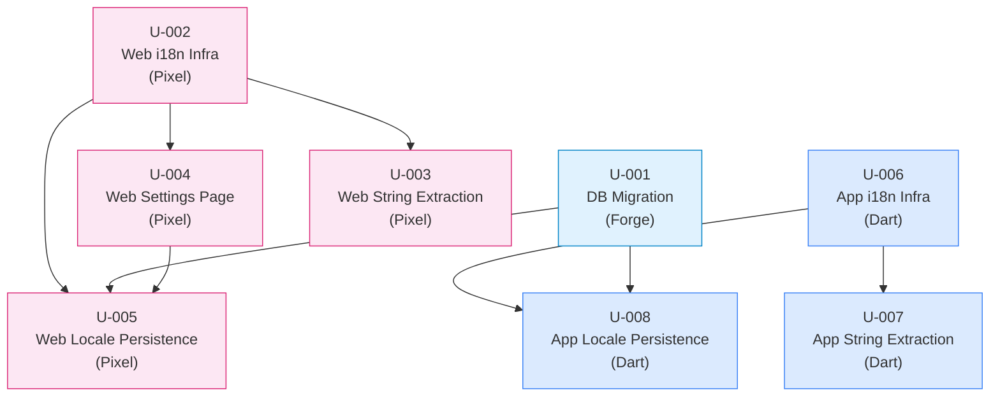

# Implementation Units -- Localization (v1: English-Only Infrastructure)

**Feature:** Localization
**Version:** v1 -- English-only infrastructure, no additional languages yet
**Author:** Atlas (Technical Architect)
**Date:** 2026-02-21
**Status:** Draft

---

## Overview

This document breaks the Localization feature into eight ordered, independently-implementable units. The goal of v1 is to install all i18n plumbing across the three codebases (pulse-supabase, pulse-web, pulse-app) so that every user-facing string is externalized into message files and the locale preference is persisted and synchronized between Flutter and the WebView. No second language is shipped in v1; the sole locale is `en`.

### Specialist Agent Assignments

| Agent | Scope |
|-------|-------|
| **Forge** | Supabase database migration |
| **Pixel** | pulse-web (Next.js) i18n infrastructure, string extraction, settings page, persistence |
| **Dart** | pulse-app (Flutter) i18n infrastructure, string extraction, persistence and bridge |

---

## Dependency Graph



---

## Execution Plan

### Phase 1 -- Foundation (no dependencies, fully parallel)

| Unit | Agent | Est. Size |
|------|-------|-----------|
| U-001 | Forge | Small |
| U-002 | Pixel | Medium |
| U-006 | Dart  | Medium |

All three units have zero dependencies and can execute simultaneously across all three agents.

### Phase 2 -- String Extraction & Settings (depends on Phase 1)

| Unit | Agent | Blocked By |
|------|-------|------------|
| U-003 | Pixel | U-002 |
| U-004 | Pixel | U-002 |
| U-007 | Dart  | U-006 |

U-003 and U-004 are independent of each other and can run in parallel once U-002 is complete. U-007 can run as soon as U-006 is complete, in parallel with the Pixel units.

### Phase 3 -- Persistence & Sync (depends on Phases 1 + 2)

| Unit | Agent | Blocked By |
|------|-------|------------|
| U-005 | Pixel | U-001, U-002, U-004 |
| U-008 | Dart  | U-001, U-006 |

U-008 only needs U-001 and U-006, so it can start as soon as both are complete (potentially in Phase 2 if U-001 finishes in Phase 1). U-005 requires the settings page (U-004) to exist, so it runs last on the Pixel track.

### Critical Path

```
U-002 -> U-004 -> U-005   (Pixel track, longest chain = 3 units)
```

The Forge track (U-001) and Dart track (U-006 -> U-007, U-006 -> U-008) are shorter and will complete before the Pixel critical path.

---

## Unit Definitions

---

### U-001: Database Migration -- `language_preference` Column

**Assigned Agent:** Forge
**Dependencies:** None

#### Scope

Add a `language_preference` column to the existing `profiles` table. This stores the user's chosen locale as a BCP 47 language tag (e.g., `'en'`). The column defaults to `'en'` so existing rows and new signups require no migration backfill.

#### Files to Create/Modify

| Action | Path |
|--------|------|
| **Create** | `pulse-supabase/supabase/migrations/20260221100000_add_language_preference.sql` |

#### Migration SQL

```sql
-- Add language preference to profiles table
ALTER TABLE profiles
  ADD COLUMN language_preference TEXT NOT NULL DEFAULT 'en';

-- Add CHECK constraint for valid BCP 47 tags (v1: only 'en')
ALTER TABLE profiles
  ADD CONSTRAINT profiles_language_preference_valid
  CHECK (language_preference ~ '^[a-z]{2}(-[A-Z]{2})?$');

-- Comment for documentation
COMMENT ON COLUMN profiles.language_preference
  IS 'BCP 47 language tag for user locale preference. Default: en';
```

#### Integration Contract

- **Exposes:** `profiles.language_preference` column (TEXT, NOT NULL, DEFAULT `'en'`)
- **Consumed by:** U-005 (pulse-web reads/writes via Supabase client), U-008 (pulse-app reads/writes via Supabase client)
- **RLS:** Existing `profiles` RLS policies already cover SELECT/UPDATE on own row; no new policies needed

#### Acceptance Criteria

- [ ] Migration file exists at the specified path with a valid timestamp prefix
- [ ] `supabase db reset` succeeds without errors
- [ ] Existing rows in `profiles` have `language_preference = 'en'` after migration
- [ ] New profile inserts without specifying `language_preference` default to `'en'`
- [ ] Inserting an invalid value (e.g., `'123'`, `''`) is rejected by the CHECK constraint
- [ ] Inserting a valid BCP 47 tag (e.g., `'en'`, `'es'`, `'pt-BR'`) succeeds
- [ ] Existing RLS policies still allow users to read/update their own `language_preference`

---

### U-002: pulse-web i18n Infrastructure

**Assigned Agent:** Pixel
**Dependencies:** None

#### Scope

Install and configure `next-intl` for the pulse-web Next.js app. Set up the provider hierarchy, create the English message file skeleton, and configure the `next-intl` request handler. After this unit, `useTranslations()` is available in any client component but no strings have been migrated yet.

#### Files to Create/Modify

| Action | Path |
|--------|------|
| **Install** | `npm install next-intl` (adds to `package.json`) |
| **Create** | `pulse-web/src/i18n/request.ts` |
| **Create** | `pulse-web/src/i18n/routing.ts` |
| **Create** | `pulse-web/src/messages/en.json` |
| **Modify** | `pulse-web/src/app/layout.tsx` |
| **Create** | `pulse-web/src/components/providers/intl-provider.tsx` |

#### Implementation Details

**`src/messages/en.json`** -- Skeleton with namespace structure matching the component tree:

```json
{
  "common": {
    "appName": "Pulse",
    "tagline": "Effortless peace of mind",
    "loading": "Loading...",
    "retry": "Retry",
    "cancel": "Cancel",
    "continue": "Continue",
    "backToHome": "Back to Home",
    "signIn": "Sign in to get started",
    "mobileSignInNote": "Use the mobile app to sign in and create your profile. Then access your dashboard here."
  },
  "auth": {
    "errorTitle": "Authentication Error",
    "errorMessage": "Sorry, we couldn't sign you in. Please try again."
  },
  "profileSetup": {
    "title": "Set up your profile",
    "displayNameLabel": "Display Name",
    "displayNamePlaceholder": "Enter your name",
    "avatarLabel": "Choose your avatar",
    "selectedAvatarLabel": "Selected Avatar",
    "creating": "Creating..."
  },
  "dashboard": {
    "greeting": {
      "morning": "Good morning",
      "afternoon": "Good afternoon",
      "evening": "Good evening"
    },
    "activeSubtitle": "You're all set for today. Check on your connections below.",
    "inactiveSubtitle": "Welcome back! Here's your dashboard.",
    "statusTitle": "Your Status",
    "activeStatus": "You are active today",
    "pulsedTime": "Pulsed {time}",
    "notPulsedYet": "You haven't pulsed yet today",
    "pulseAutoSent": "Your pulse was sent automatically",
    "connectionActive": "Active",
    "connectionWaiting": "Waiting...",
    "connectionActiveToday": "Active today",
    "connectionInactive": "Inactive",
    "noConnectionsTitle": "No connections yet",
    "noConnectionsMessage": "You haven't added any connections to your Pulse network. Start connecting with family and friends to share your daily check-ins.",
    "inviteSomeone": "Invite someone",
    "comingSoon": "Coming soon in Unit 3: Connections",
    "wisdomDismiss": "Tap to dismiss"
  },
  "connections": {
    "title": "Connections",
    "connectionCount": "{count, plural, one {# connection} other {# connections}}",
    "addConnection": "+ Add Connection",
    "noConnectionsTitle": "No connections yet",
    "noConnectionsMessage": "Add your first connection to start sharing your daily pulse",
    "addFirstConnection": "Add Your First Connection",
    "removeConnection": "Remove Connection",
    "removeConfirm": "Remove this connection? You can restore it within 30 days.",
    "removeFailed": "Failed to remove connection",
    "inviteTitle": "Invite Connection",
    "inviteCodeLabel": "Invite Code",
    "inviteExpiry": "Expires in 30 days",
    "inviteOneTime": "One-time use",
    "shareInvite": "Share Invite",
    "shareTitle": "Join Pulse",
    "shareText": "Join me on Pulse! Use code: {code}"
  },
  "settings": {
    "title": "Settings",
    "languageLabel": "Language",
    "languageDescription": "Choose your preferred language"
  },
  "webview": {
    "loadFailed": "Failed to load Dashboard",
    "unknownError": "Unknown error occurred"
  }
}
```

**`src/i18n/request.ts`** -- next-intl server request configuration:

```typescript
import { getRequestConfig } from 'next-intl/server';

export default getRequestConfig(async () => {
  const locale = 'en'; // v1: hardcoded; v2 will read from cookie/profile
  return {
    locale,
    messages: (await import(`../messages/${locale}.json`)).default,
  };
});
```

**`src/i18n/routing.ts`** -- Supported locales definition:

```typescript
export const locales = ['en'] as const;
export const defaultLocale = 'en' as const;
export type Locale = (typeof locales)[number];
```

**`src/components/providers/intl-provider.tsx`** -- Client wrapper:

```typescript
'use client';
import { NextIntlClientProvider } from 'next-intl';

export function IntlProvider({
  locale,
  messages,
  children,
}: {
  locale: string;
  messages: Record<string, any>;
  children: React.ReactNode;
}) {
  return (
    <NextIntlClientProvider locale={locale} messages={messages}>
      {children}
    </NextIntlClientProvider>
  );
}
```

**`src/app/layout.tsx`** -- Wrap children with `NextIntlClientProvider` (or use the `next-intl` plugin approach). The `<html lang>` attribute will be driven by the current locale.

#### Integration Contract

- **Exposes:** `useTranslations(namespace)` hook available in all client components
- **Exposes:** `src/messages/en.json` message catalog (namespaced keys)
- **Exposes:** `src/i18n/routing.ts` with `locales`, `defaultLocale`, `Locale` type
- **Consumed by:** U-003 (string extraction), U-004 (settings page), U-005 (locale persistence)

#### Acceptance Criteria

- [ ] `npm install` succeeds; `next-intl` is in `package.json` dependencies
- [ ] `npm run build` succeeds without errors
- [ ] `src/messages/en.json` exists and is valid JSON with the namespace structure above
- [ ] A test client component can call `useTranslations('common')` and render `t('appName')` as `"Pulse"`
- [ ] `npm run lint` passes (Biome)
- [ ] `npx tsc --noEmit` passes
- [ ] Existing tests still pass (`npm test`)

---

### U-003: pulse-web String Extraction

**Assigned Agent:** Pixel
**Dependencies:** U-002

#### Scope

Replace every hardcoded user-facing string across all pulse-web components and pages with `useTranslations()` / `t()` calls referencing keys in `en.json`. Server Components that cannot use hooks will receive translated strings as props from their parent layout or page, or use the `getTranslations()` server utility from `next-intl/server`.

#### Files to Modify

| Action | Path | Strings to Extract |
|--------|------|--------------------|
| **Modify** | `src/app/page.tsx` | "Pulse", "Effortless peace of mind", "Sign in to get started", mobile sign-in note |
| **Modify** | `src/app/auth/error/page.tsx` | "Authentication Error", error message, "Back to Home" |
| **Modify** | `src/app/profile-setup/page.tsx` | "Set up your profile", form labels, "Continue", "Creating..." |
| **Modify** | `src/app/dashboard/page.tsx` | No visible strings (data fetching only), but pass locale-aware props if needed |
| **Modify** | `src/app/connections/page.tsx` | "Connections", count text, "+ Add Connection", confirm/alert messages |
| **Modify** | `src/components/dashboard/dashboard-content.tsx` | Greeting strings, subtitle text |
| **Modify** | `src/components/dashboard/status-card.tsx` | "Your Status", all status text variants |
| **Modify** | `src/components/dashboard/connection-card.tsx` | "Active", "Waiting..." |
| **Modify** | `src/components/dashboard/empty-connections-view.tsx` | "No connections yet", description, button text |
| **Modify** | `src/components/dashboard/wisdom-card.tsx` | "Tap to dismiss" |
| **Modify** | `src/components/connections/connection-card.tsx` | "Active today", "Inactive", "Remove Connection" |
| **Modify** | `src/components/connections/empty-connections-view.tsx` | "No connections yet", description, button text |
| **Modify** | `src/components/connections/invite-modal.tsx` | "Invite Connection", labels, expiry text, "Share Invite" |
| **Modify** | `src/app/layout.tsx` | Metadata strings (title, description) -- use `generateMetadata` with `getTranslations` |
| **Update** | `src/messages/en.json` | Add any keys discovered during extraction that are missing from the skeleton |

#### Implementation Details

**Server Components** (e.g., `page.tsx` files) use `getTranslations` from `next-intl/server`:

```typescript
import { getTranslations } from 'next-intl/server';

export default async function Home() {
  const t = await getTranslations('common');
  // ... use t('appName'), t('tagline'), etc.
}
```

**Client Components** use the `useTranslations` hook:

```typescript
'use client';
import { useTranslations } from 'next-intl';

export function StatusCard({ isActive, pulseTime }: StatusCardProps) {
  const t = useTranslations('dashboard');
  // ... use t('statusTitle'), t('activeStatus'), etc.
}
```

**ICU Message Syntax** for interpolation:

```typescript
// en.json: "pulsedTime": "Pulsed {time}"
t('pulsedTime', { time: formattedTime })

// en.json: "connectionCount": "{count, plural, one {# connection} other {# connections}}"
t('connectionCount', { count: connections.length })
```

#### Integration Contract

- **Exposes:** All user-facing strings now flow through `en.json`; changing a key in the JSON changes the UI
- **Consumed by:** Future language packs (v2+) only need to provide translations for the same keys

#### Acceptance Criteria

- [ ] Zero hardcoded English strings remain in any `.tsx` component or page (excluding technical strings like CSS class names, HTML attributes, console.log)
- [ ] `npm run build` succeeds
- [ ] `npm run lint` passes
- [ ] `npx tsc --noEmit` passes
- [ ] All existing tests pass (update test assertions to match translated output if needed)
- [ ] Visual regression: UI looks identical before and after -- no missing text, no key names displayed
- [ ] `en.json` contains every key referenced by `t()` calls -- no missing key warnings in console

---

### U-004: pulse-web Settings Page

**Assigned Agent:** Pixel
**Dependencies:** U-002

#### Scope

Create a new `/settings` route with a language selector dropdown. Add navigation to the settings page from the dashboard (e.g., a gear icon in the header). The settings page uses the i18n infrastructure from U-002 for its own strings. In v1 the dropdown only contains "English" but the UI is ready for additional options.

#### Files to Create/Modify

| Action | Path |
|--------|------|
| **Create** | `pulse-web/src/app/settings/page.tsx` |
| **Create** | `pulse-web/src/components/settings/language-selector.tsx` |
| **Modify** | `pulse-web/src/components/dashboard/dashboard-content.tsx` (add settings nav link) |
| **Update** | `pulse-web/src/messages/en.json` (add any missing settings keys) |

#### Implementation Details

**`src/app/settings/page.tsx`** -- Server Component wrapper:

- Authenticates user (redirect to `/` if not logged in)
- Fetches current `language_preference` from profile (falls back to `'en'`)
- Renders `<LanguageSelector>` client component with current value
- Includes a back button to return to dashboard

**`src/components/settings/language-selector.tsx`** -- Client Component:

- Displays a styled `<select>` or radio group with available locales
- v1: Only `{ value: 'en', label: 'English' }` option
- On change: calls `onLocaleChange(newLocale)` callback (wired up in U-005)
- Visual: matches Pulse design system (teal accent, rounded corners, off-white background)

**Dashboard navigation** -- Add a gear/settings icon button in the `DashboardContent` header area:

```tsx
<Link href="/settings" className="...">
  <SettingsIcon />
</Link>
```

Or via FlutterBridge if navigating natively:

```tsx
const handleSettingsNav = () => {
  if (window.FlutterBridge) {
    window.FlutterBridge.postMessage(JSON.stringify({ type: 'NAVIGATE', payload: '/settings' }));
  } else {
    router.push('/settings');
  }
};
```

#### Integration Contract

- **Exposes:** `/settings` route accessible from dashboard
- **Exposes:** `<LanguageSelector>` component with `currentLocale: string` and `onLocaleChange: (locale: string) => void` props
- **Consumed by:** U-005 (wires `onLocaleChange` to persistence logic)

#### Acceptance Criteria

- [ ] `/settings` route renders without errors for authenticated users
- [ ] Unauthenticated users are redirected to `/`
- [ ] Language selector displays "English" as the current/only option
- [ ] Dashboard has a visible navigation element (icon/link) to `/settings`
- [ ] Settings page has a back/return navigation to dashboard
- [ ] Page uses translated strings from `en.json` (via `useTranslations('settings')`)
- [ ] `npm run build` succeeds
- [ ] `npm run lint` and `npx tsc --noEmit` pass

---

### U-005: pulse-web Locale Persistence & Sync

**Assigned Agent:** Pixel
**Dependencies:** U-001, U-002, U-004

#### Scope

Wire up the full locale lifecycle on the web side:

1. **Read:** On app load, determine locale from (in priority order): Supabase profile `language_preference` > localStorage fallback > `'en'` default
2. **Write:** When user changes locale in settings, update localStorage, Supabase profile, and the active `next-intl` locale
3. **Bridge:** Listen for `LOCALE_CHANGED` messages from FlutterBridge (Flutter changed locale natively) and apply the new locale
4. **Bridge:** Send `LOCALE_CHANGED` message to FlutterBridge when web-side locale changes

#### Files to Create/Modify

| Action | Path |
|--------|------|
| **Create** | `pulse-web/src/lib/services/locale-service.ts` |
| **Create** | `pulse-web/src/hooks/use-locale-sync.ts` |
| **Modify** | `pulse-web/src/app/settings/page.tsx` (wire onLocaleChange) |
| **Modify** | `pulse-web/src/components/settings/language-selector.tsx` (wire onLocaleChange) |
| **Modify** | `pulse-web/src/components/providers/intl-provider.tsx` (dynamic locale state) |
| **Modify** | `pulse-web/src/app/layout.tsx` (read locale from cookie/localStorage on server) |
| **Modify** | `pulse-web/src/i18n/request.ts` (read locale from cookie) |

#### Implementation Details

**`src/lib/services/locale-service.ts`:**

```typescript
const LOCALE_STORAGE_KEY = 'pulse-locale';

export const LocaleService = {
  getStoredLocale(): string {
    if (typeof window === 'undefined') return 'en';
    return localStorage.getItem(LOCALE_STORAGE_KEY) || 'en';
  },

  setStoredLocale(locale: string): void {
    localStorage.setItem(LOCALE_STORAGE_KEY, locale);
    // Also set as cookie for SSR access
    document.cookie = `pulse-locale=${locale}; path=/; max-age=${60 * 60 * 24 * 365}; SameSite=Lax`;
  },

  async syncToProfile(locale: string): Promise<void> {
    const { supabase } = await import('@/lib/supabase/client');
    const { data: { user } } = await supabase.auth.getUser();
    if (!user) return;

    await supabase
      .from('profiles')
      .update({ language_preference: locale })
      .eq('id', user.id);
  },

  async getProfileLocale(): Promise<string | null> {
    const { supabase } = await import('@/lib/supabase/client');
    const { data: { user } } = await supabase.auth.getUser();
    if (!user) return null;

    const { data } = await supabase
      .from('profiles')
      .select('language_preference')
      .eq('id', user.id)
      .single();

    return data?.language_preference || null;
  },

  notifyFlutterBridge(locale: string): void {
    if (typeof window !== 'undefined' && (window as any).FlutterBridge) {
      (window as any).FlutterBridge.postMessage(
        JSON.stringify({ type: 'LOCALE_CHANGED', payload: { locale } })
      );
    }
  },
};
```

**`src/hooks/use-locale-sync.ts`:**

A custom hook that:
- On mount, reads locale from profile (or localStorage fallback)
- Sets up a `message` event listener on the FlutterBridge for incoming `LOCALE_CHANGED` events
- Provides a `changeLocale(newLocale)` function that writes to all three targets (localStorage, Supabase, FlutterBridge)

**FlutterBridge message protocol** for locale sync:

```json
// Web -> Flutter
{ "type": "LOCALE_CHANGED", "payload": { "locale": "en" } }

// Flutter -> Web (received via FlutterBridge JavaScript injection)
{ "type": "LOCALE_CHANGED", "payload": { "locale": "en" } }
```

#### Integration Contract

- **Exposes:** `LocaleService` with `getStoredLocale()`, `setStoredLocale()`, `syncToProfile()`, `getProfileLocale()`, `notifyFlutterBridge()`
- **Exposes:** `useLocaleSync()` hook returning `{ locale, changeLocale, isLoading }`
- **Exposes:** FlutterBridge message `LOCALE_CHANGED` (bidirectional)
- **Consumed by:** U-008 (Flutter side listens for and sends `LOCALE_CHANGED` messages)

#### Acceptance Criteria

- [ ] On first load with no stored locale, app defaults to `'en'`
- [ ] Changing locale in settings updates localStorage with the new value
- [ ] Changing locale in settings updates `profiles.language_preference` in Supabase
- [ ] Changing locale in settings sends `LOCALE_CHANGED` to FlutterBridge (if available)
- [ ] Receiving `LOCALE_CHANGED` from FlutterBridge updates the active locale in the web app
- [ ] On subsequent page loads, the stored locale is read and applied (no flash of wrong locale)
- [ ] `npm run build` succeeds
- [ ] `npm run lint` and `npx tsc --noEmit` pass
- [ ] All existing tests pass

---

### U-006: pulse-app i18n Infrastructure

**Assigned Agent:** Dart
**Dependencies:** None

#### Scope

Set up Flutter's localization infrastructure: add `flutter_localizations`, `intl`, and `shared_preferences` dependencies; create `l10n.yaml` configuration; create the English ARB file; generate the `AppLocalizations` class; and wire the locale into `MaterialApp.router`. After this unit, `AppLocalizations.of(context)` is available but no strings have been migrated yet.

#### Files to Create/Modify

| Action | Path |
|--------|------|
| **Modify** | `pulse-app/pubspec.yaml` (add dependencies) |
| **Create** | `pulse-app/l10n.yaml` |
| **Create** | `pulse-app/lib/l10n/app_en.arb` |
| **Create** | `pulse-app/lib/core/providers/locale_provider.dart` |
| **Modify** | `pulse-app/lib/main.dart` (add localization delegates, locale provider) |

#### Implementation Details

**`pubspec.yaml`** additions:

```yaml
dependencies:
  flutter_localizations:
    sdk: flutter
  intl: any  # version managed by flutter_localizations
  shared_preferences: ^2.2.3
```

**`l10n.yaml`:**

```yaml
arb-dir: lib/l10n
template-arb-file: app_en.arb
output-localization-file: app_localizations.dart
output-class: AppLocalizations
synthetic-package: false
output-dir: lib/l10n/generated
```

**`lib/l10n/app_en.arb`** -- English ARB file with keys matching Flutter screens:

```json
{
  "@@locale": "en",
  "appName": "Pulse",
  "tagline": "Effortless peace of mind",
  "signInWithGoogle": "Sign in with Google",
  "signInWithEmail": "Sign in with Email",
  "enterYourEmail": "Enter your email",
  "sendMagicLink": "Send Magic Link",
  "cancel": "Cancel",
  "checkEmailMessage": "Check your email for the magic link!",
  "pleaseEnterEmail": "Please enter your email",
  "pleaseEnterValidEmail": "Please enter a valid email",
  "failedSignInGoogle": "Failed to sign in with Google: {error}",
  "@failedSignInGoogle": { "placeholders": { "error": { "type": "String" } } },
  "failedSendMagicLink": "Failed to send magic link: {error}",
  "@failedSendMagicLink": { "placeholders": { "error": { "type": "String" } } },
  "profileSetupTitle": "Set up your profile",
  "displayName": "Display Name",
  "enterYourName": "Enter your name",
  "chooseYourAvatar": "Choose your avatar",
  "selectedAvatar": "Selected Avatar",
  "continueButton": "Continue",
  "failedCreateProfile": "Failed to create profile: {error}",
  "@failedCreateProfile": { "placeholders": { "error": { "type": "String" } } },
  "failedLoadDashboard": "Failed to load Dashboard",
  "unknownError": "Unknown error occurred",
  "retry": "Retry"
}
```

**`lib/core/providers/locale_provider.dart`:**

```dart
import 'package:flutter/material.dart';
import 'package:flutter_riverpod/flutter_riverpod.dart';

/// Provider for the current app locale
final localeProvider = StateProvider<Locale>((ref) {
  return const Locale('en');
});
```

**`lib/main.dart`** changes:

```dart
import 'package:flutter_localizations/flutter_localizations.dart';
import 'l10n/generated/app_localizations.dart';
import 'core/providers/locale_provider.dart';

class PulseApp extends ConsumerWidget {
  const PulseApp({super.key});

  @override
  Widget build(BuildContext context, WidgetRef ref) {
    final locale = ref.watch(localeProvider);

    return MaterialApp.router(
      title: 'Pulse',
      theme: AppTheme.lightTheme,
      routerConfig: _router,
      debugShowCheckedModeBanner: false,
      locale: locale,
      localizationsDelegates: const [
        AppLocalizations.delegate,
        GlobalMaterialLocalizations.delegate,
        GlobalWidgetsLocalizations.delegate,
        GlobalCupertinoLocalizations.delegate,
      ],
      supportedLocales: AppLocalizations.supportedLocales,
    );
  }
}
```

Note: `PulseApp` changes from `StatelessWidget` to `ConsumerWidget` to watch the locale provider.

#### Integration Contract

- **Exposes:** `AppLocalizations.of(context)` available in all widgets
- **Exposes:** `localeProvider` (Riverpod `StateProvider<Locale>`) for reading/updating locale
- **Exposes:** `lib/l10n/app_en.arb` as the English message catalog
- **Consumed by:** U-007 (string extraction), U-008 (locale persistence and bridge)

#### Acceptance Criteria

- [ ] `flutter pub get` succeeds with new dependencies
- [ ] `flutter gen-l10n` (or automatic generation) produces `lib/l10n/generated/app_localizations.dart`
- [ ] `flutter analyze` passes with no errors
- [ ] `AppLocalizations.of(context)!.appName` returns `"Pulse"` in a test widget
- [ ] `MaterialApp.router` includes localization delegates and supported locales
- [ ] `localeProvider` is accessible via Riverpod and defaults to `Locale('en')`
- [ ] Existing tests still pass (`flutter test`)

---

### U-007: pulse-app String Extraction

**Assigned Agent:** Dart
**Dependencies:** U-006

#### Scope

Replace every hardcoded user-facing string in all Flutter screens and widgets with `AppLocalizations.of(context)!` calls referencing keys in `app_en.arb`.

#### Files to Modify

| Action | Path | Strings to Extract |
|--------|------|--------------------|
| **Modify** | `lib/features/auth/auth_screen.dart` | "Pulse", "Effortless peace of mind", "Sign in with Google", "Sign in with Email", "Enter your email", "Send Magic Link", "Cancel", snackbar text, error messages, validation messages |
| **Modify** | `lib/features/auth/widgets/auth_button.dart` | No strings (receives label as prop) -- verify only |
| **Modify** | `lib/features/profile/profile_setup_screen.dart` | "Set up your profile", "Display Name", "Enter your name", "Choose your avatar", "Selected Avatar", "Continue", error messages |
| **Modify** | `lib/features/splash/splash_screen.dart` | "Pulse" (title text) |
| **Modify** | `lib/features/webview/pulse_webview.dart` | "Failed to load Dashboard", error message, "Retry" |
| **Modify** | `lib/main.dart` | "Dashboard - Coming Soon" (placeholder text) |
| **Update** | `lib/l10n/app_en.arb` | Add any keys discovered during extraction that are missing from the skeleton |

#### Implementation Details

Pattern for extracting strings:

```dart
// Before
const Text('Pulse')

// After
Text(AppLocalizations.of(context)!.appName)
```

For strings with parameters:

```dart
// Before
Text('Failed to sign in with Google: ${e.toString()}')

// After
Text(AppLocalizations.of(context)!.failedSignInGoogle(e.toString()))
```

Note: `const` modifiers must be removed from widgets that now depend on `AppLocalizations.of(context)` since the value is no longer compile-time constant. Verify that `AppLocalizations.of(context)` is not called where `context` is unavailable (e.g., in `initState`). For such cases, defer to `didChangeDependencies` or pass the localized string from the `build` method.

#### Integration Contract

- **Exposes:** All Flutter user-facing strings now flow through `app_en.arb`; changing a value in the ARB file changes the UI
- **Consumed by:** Future language ARB files (v2+) only need to provide translations for the same keys

#### Acceptance Criteria

- [ ] Zero hardcoded English strings remain in any `.dart` widget or screen (excluding technical strings like route paths, debug prints, key names)
- [ ] `flutter analyze` passes with no errors
- [ ] `flutter test` passes (update test assertions if needed)
- [ ] Visual regression: UI looks identical before and after -- no missing text, no key names displayed
- [ ] `app_en.arb` contains every key referenced by `AppLocalizations.of(context)!` calls
- [ ] No `const` keyword errors on widgets that now use localized strings

---

### U-008: pulse-app Locale Persistence & Bridge

**Assigned Agent:** Dart
**Dependencies:** U-001, U-006

#### Scope

Wire up the full locale lifecycle on the Flutter side:

1. **Read:** On app start, determine locale from (in priority order): Supabase profile `language_preference` > SharedPreferences fallback > platform default > `'en'`
2. **Write:** When locale changes, update SharedPreferences, Supabase profile, and the Riverpod `localeProvider`
3. **Bridge:** Send `LOCALE_CHANGED` message to WebView via JavaScript injection when Flutter locale changes
4. **Bridge:** Handle incoming `LOCALE_CHANGED` messages from WebView (user changed locale on settings page)

#### Files to Create/Modify

| Action | Path |
|--------|------|
| **Create** | `pulse-app/lib/core/services/locale_service.dart` |
| **Modify** | `pulse-app/lib/core/providers/locale_provider.dart` (enhance with async initialization) |
| **Modify** | `pulse-app/lib/features/webview/pulse_webview.dart` (handle LOCALE_CHANGED messages, expose locale injection) |
| **Modify** | `pulse-app/lib/features/splash/splash_screen.dart` (initialize locale on startup) |
| **Modify** | `pulse-app/lib/main.dart` (initialize SharedPreferences before runApp) |

#### Implementation Details

**`lib/core/services/locale_service.dart`:**

```dart
import 'package:flutter/material.dart';
import 'package:shared_preferences/shared_preferences.dart';
import 'package:supabase_flutter/supabase_flutter.dart';
import '../config/supabase_config.dart';

class LocaleService {
  static const _storageKey = 'pulse_locale';
  final SharedPreferences _prefs;

  LocaleService(this._prefs);

  /// Get stored locale from SharedPreferences
  Locale getStoredLocale() {
    final stored = _prefs.getString(_storageKey);
    if (stored != null) {
      return Locale(stored);
    }
    return const Locale('en');
  }

  /// Save locale to SharedPreferences
  Future<void> setStoredLocale(Locale locale) async {
    await _prefs.setString(_storageKey, locale.languageCode);
  }

  /// Sync locale to Supabase profile
  Future<void> syncToProfile(Locale locale) async {
    try {
      final user = SupabaseConfig.client.auth.currentUser;
      if (user == null) return;

      await SupabaseConfig.client
          .from('profiles')
          .update({'language_preference': locale.languageCode})
          .eq('id', user.id);
    } catch (e) {
      debugPrint('Error syncing locale to profile: $e');
    }
  }

  /// Fetch locale from Supabase profile
  Future<Locale?> getProfileLocale() async {
    try {
      final user = SupabaseConfig.client.auth.currentUser;
      if (user == null) return null;

      final response = await SupabaseConfig.client
          .from('profiles')
          .select('language_preference')
          .eq('id', user.id)
          .single();

      final lang = response['language_preference'] as String?;
      return lang != null ? Locale(lang) : null;
    } catch (e) {
      debugPrint('Error fetching profile locale: $e');
      return null;
    }
  }
}
```

**WebView bridge integration** in `pulse_webview.dart`:

Add handling for `LOCALE_CHANGED` in `_handleMessage`:

```dart
void _handleMessage(String message) {
  // ... existing ready handling ...
  if (message.contains('"type":"LOCALE_CHANGED"') ||
      message.contains('"type": "LOCALE_CHANGED"')) {
    // Parse locale from payload and update localeProvider
  }
}
```

Add a method to inject locale change into WebView:

```dart
Future<void> _sendLocaleToWebView(String locale) async {
  final js = '''
    window.dispatchEvent(new CustomEvent('flutter-locale-changed', {
      detail: { locale: '$locale' }
    }));
  ''';
  await _controller.runJavaScript(js);
}
```

**Riverpod provider** -- The `localeProvider` becomes a `StateNotifierProvider` or enhanced `StateProvider` that auto-initializes from `LocaleService` on first read.

#### Integration Contract

- **Exposes:** `LocaleService` with `getStoredLocale()`, `setStoredLocale()`, `syncToProfile()`, `getProfileLocale()`
- **Exposes:** `localeServiceProvider` (Riverpod provider)
- **Exposes:** FlutterBridge message `LOCALE_CHANGED` (bidirectional, matching U-005 protocol)
- **Consumed by:** U-005 (web side receives/sends matching `LOCALE_CHANGED` messages)

#### Acceptance Criteria

- [ ] On first launch with no stored locale, app defaults to `'en'`
- [ ] Locale is loaded from SharedPreferences on app start and applied to `MaterialApp`
- [ ] If Supabase profile has a different `language_preference`, it takes priority over SharedPreferences
- [ ] Changing locale updates SharedPreferences
- [ ] Changing locale updates `profiles.language_preference` in Supabase
- [ ] Changing locale sends `LOCALE_CHANGED` to WebView (if WebView is active)
- [ ] Receiving `LOCALE_CHANGED` from WebView updates the Flutter locale
- [ ] `flutter analyze` passes
- [ ] `flutter test` passes
- [ ] SharedPreferences is initialized before `runApp` in `main.dart`

---

## Summary Matrix

| Unit | Agent | Dependencies | Phase | Key Deliverable |
|------|-------|-------------|-------|-----------------|
| U-001 | Forge | -- | 1 | `language_preference` column on `profiles` |
| U-002 | Pixel | -- | 1 | `next-intl` configured, `en.json` skeleton, provider wired |
| U-006 | Dart | -- | 1 | `flutter_localizations` configured, ARB file, locale provider |
| U-003 | Pixel | U-002 | 2 | All web strings extracted to `en.json` |
| U-004 | Pixel | U-002 | 2 | `/settings` route with language selector |
| U-007 | Dart | U-006 | 2 | All Flutter strings extracted to `app_en.arb` |
| U-005 | Pixel | U-001, U-002, U-004 | 3 | Web locale persistence + FlutterBridge sync |
| U-008 | Dart | U-001, U-006 | 3 | Flutter locale persistence + FlutterBridge sync |

---

## Bridge Protocol Reference

The following FlutterBridge message is used for bidirectional locale synchronization between pulse-app and pulse-web:

```json
{
  "type": "LOCALE_CHANGED",
  "payload": {
    "locale": "en"
  }
}
```

**Direction: Flutter -> Web:**
- Flutter injects JavaScript into WebView that dispatches a `CustomEvent('flutter-locale-changed')` on `window`
- The web `useLocaleSync` hook listens for this event

**Direction: Web -> Flutter:**
- Web calls `window.FlutterBridge.postMessage(JSON.stringify({ type: 'LOCALE_CHANGED', payload: { locale } }))`
- Flutter's `_handleMessage` in `PulseWebView` parses and applies the new locale via `localeProvider`

---

## Risk Notes

1. **next-intl version compatibility:** Verify `next-intl` supports Next.js 16 and React 19. If not, pin to a compatible version or use the `next-intl@canary` channel.
2. **Server Component string extraction:** Some Server Components (e.g., `dashboard/page.tsx`) do not render UI strings directly but pass data to Client Components. Ensure the `getTranslations` server utility is used where needed.
3. **`const` removal in Flutter:** Extracting strings breaks `const` constructors. This is expected and should not be flagged as a regression.
4. **SharedPreferences initialization order:** `SharedPreferences.getInstance()` must complete before `runApp`. Use `WidgetsFlutterBinding.ensureInitialized()` (already present) and `await` the instance in `main()`.
