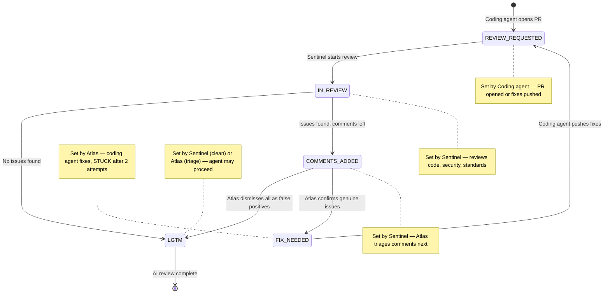

# Code Review Flow

## 1. Overview

This document defines the structured code review lifecycle for PRs opened by coding agents (Forge, Pixel, Dart). It complements `shared/git_strategy.md` — branching conventions, commit formats, and PR templates remain there. This file governs **what happens after a PR is opened**: tracking, AI review, comment triage, fix iterations, and human review.

The flow introduces:
- A per-feature **`pull_requests.md`** tracker for PR status visibility.
- A **state machine** for AI Review Status with clear ownership per transition.
- A **comment triage** role for Atlas to evaluate Sentinel's review comments before fixes begin.
- **Sequential PR processing** — one PR reviewed to LGTM at a time per the single-instance rule.

---

## 2. The `pull_requests.md` Tracker

Each feature maintains a PR tracker at:

```
projects/[project]/features/[feature]/pull_requests.md
```

### Template

```markdown
# Pull Requests — [Feature ID]: [Feature Name]

| Sr No | PR Status | PR Number | Git PR Link | AI Review Status | Human Review Status |
|-------|-----------|-----------|-------------|------------------|---------------------|
| 1     | open      | #42       | [PR #42](link) | REVIEW_REQUESTED | PENDING |
```

### Column Definitions

| Column | Values | Updated By |
|--------|--------|------------|
| **Sr No** | Auto-incrementing integer | Coding agent (on PR creation) |
| **PR Status** | `open`, `merged`, `closed` | Friday (mirrors GitHub state) |
| **PR Number** | GitHub PR number (e.g., `#42`) | Coding agent (on PR creation) |
| **Git PR Link** | Markdown link to the GitHub PR | Coding agent (on PR creation) |
| **AI Review Status** | See state machine below | Sentinel, Atlas, or coding agent (per transition rules) |
| **Human Review Status** | `PENDING`, `APPROVED`, `CHANGES_REQUESTED` | Friday (mirrors human reviewer feedback) |

### Rules

- Rows are **never deleted** — they form a permanent audit trail.
- The coding agent creates the row when opening the PR.
- The **feature PR** (feature branch → main) also gets a row in the same table.

---

## 3. AI Review Status — State Machine

### States

| Status | Set By | Meaning |
|--------|--------|---------|
| `REVIEW_REQUESTED` | Coding agent | PR is ready for Sentinel's review. |
| `IN_REVIEW` | Sentinel | Sentinel has started reviewing. |
| `COMMENTS_ADDED` | Sentinel | Sentinel found issues and left GitHub PR comments. |
| `LGTM` | Sentinel or Atlas | No issues found (Sentinel), or all comments are false positives (Atlas). |
| `FIX_NEEDED` | Atlas | Comments triaged — genuine issues confirmed, coding agent must fix. |

### Transitions

```
REVIEW_REQUESTED → IN_REVIEW → LGTM                          (clean pass)
                             → COMMENTS_ADDED → FIX_NEEDED   (genuine issues)
                                              → LGTM          (all false positives — Atlas)
                               FIX_NEEDED → REVIEW_REQUESTED  (fixes applied, cycle restarts)
```

**Transition Rules:**
1. Only the designated agent (per "Set By") may update AI Review Status.
2. A PR must reach `LGTM` before the coding agent may start their next task.
3. `FIX_NEEDED → REVIEW_REQUESTED` requires the coding agent to push fix commits and update the status.

---

## 4. Agent Roles in the Review Flow

### Coding Agents (Forge / Pixel / Dart)

- Open the PR on GitHub.
- Add a row to `pull_requests.md` with AI Review Status = `REVIEW_REQUESTED`.
- **Do NOT start the next task** until the current PR reaches `LGTM`.
- When AI Review Status = `FIX_NEEDED`: read Atlas's triage comments on the PR, push fix commits, update AI Review Status back to `REVIEW_REQUESTED`.
- After 2 failed fix attempts on the same PR, escalate `[STUCK]` to Friday.

### Friday (CEO Assistant & Orchestrator)

- Monitors `pull_requests.md` for status changes.
- When AI Review Status = `REVIEW_REQUESTED` and Sentinel is available → invoke Sentinel.
- When AI Review Status = `COMMENTS_ADDED` and Atlas is available → invoke Atlas for comment triage.
- When AI Review Status = `FIX_NEEDED` → invoke the original coding agent to apply fixes.
- Processes PRs **sequentially** — one at a time, in Sr No order.
- Surfaces `[SECURITY_ALERT]` and `[TECH_BLOCKER]` escalations from Sentinel/Atlas to the CEO immediately.

### Sentinel (Code Reviewer)

- Updates AI Review Status to `IN_REVIEW` when starting.
- Reviews the PR per existing methodology (`review_checklist.md`, `security_policy.md`, `tech_spec.md`).
- If no issues found → set AI Review Status = `LGTM`.
- If issues found → leave detailed comments on the GitHub PR, then set AI Review Status = `COMMENTS_ADDED`.
- If a critical security flaw is found → raise `[SECURITY_ALERT]` to Friday in addition to setting `COMMENTS_ADDED`.

### Atlas (Technical Architect — Comment Triage)

- Invoked by Friday when AI Review Status = `COMMENTS_ADDED`.
- Reads all of Sentinel's GitHub PR comments.
- Evaluates each comment for validity against the tech spec, coding standards, and architectural intent.
- For **genuine issues**: replies on the PR with fix guidance for the coding agent.
- For **false positives**: replies on the PR with a dismissal rationale.
- If **all comments are false positives** → set AI Review Status = `LGTM` (skipping FIX_NEEDED).
- If **any comments are genuine** → set AI Review Status = `FIX_NEEDED`.
- If a comment reveals a **deeper architectural issue** → escalate `[TECH_BLOCKER]` to Friday instead of setting FIX_NEEDED.

---

## 5. The Review Cycle — Step by Step

1. **Coding agent** completes implementation and opens a PR to the parent feature branch.
2. **Coding agent** adds a row to `pull_requests.md` with AI Review Status = `REVIEW_REQUESTED`.
3. **Friday** detects the new `REVIEW_REQUESTED` row and checks Sentinel's availability.
4. **Friday** invokes **Sentinel** with the PR link and relevant context files.
5. **Sentinel** sets AI Review Status = `IN_REVIEW` and begins the review.
6. **Sentinel** completes the review:
   - **Path A (Clean):** No issues → Sentinel sets AI Review Status = `LGTM`. Go to step 15.
   - **Path B (Issues):** Issues found → Sentinel leaves GitHub comments and sets AI Review Status = `COMMENTS_ADDED`.
7. **Friday** detects `COMMENTS_ADDED` and invokes **Atlas** for comment triage.
8. **Atlas** reads Sentinel's comments and evaluates each one.
9. **Atlas** replies on the PR with fix guidance (genuine) or dismissal rationale (false positive) for each comment.
10. **Atlas** makes the triage decision:
    - **Path C (All false positives):** Atlas sets AI Review Status = `LGTM`. Go to step 15.
    - **Path D (Genuine issues):** Atlas sets AI Review Status = `FIX_NEEDED`.
11. **Friday** detects `FIX_NEEDED` and invokes the **original coding agent**.
12. **Coding agent** reads Atlas's triage comments, pushes fix commits to the PR branch.
13. **Coding agent** updates AI Review Status back to `REVIEW_REQUESTED`.
14. **Cycle repeats** from step 3. (The `[STUCK]` rule applies after 2 failed fix attempts.)
15. **AI review complete.** The PR has reached `LGTM`. The coding agent may proceed to their next task.

---

## 6. Rules & Constraints

- **Sequential PR processing:** PRs are reviewed one at a time, in Sr No order. A new PR's review does not begin until the previous PR in the table reaches `LGTM` or is closed.
- **Single-instance rule:** Only one instance of any agent may run at a time. If Sentinel is reviewing PR #1, PR #2 waits.
- **Human review is independent:** The Human Review Status column tracks human feedback separately. Human review may happen in parallel with or after the AI review cycle. A PR may be merged only when both AI Review Status = `LGTM` and Human Review Status = `APPROVED` (or the CEO explicitly waives human review).
- **Rows are permanent:** Never delete rows from `pull_requests.md`. Closed or abandoned PRs stay with their final status.
- **Feature PR:** The final PR merging the feature branch into `main` also gets a row in the same `pull_requests.md` table and goes through the same review cycle.
- **`[STUCK]` rule:** If a coding agent fails to fix issues after 2 attempts (2 cycles of FIX_NEEDED → REVIEW_REQUESTED → COMMENTS_ADDED/FIX_NEEDED), the coding agent escalates `[STUCK]` to Friday. Friday may attempt resolution once or escalate to the CEO.

---

## 7. Edge Cases

### Security Alert
Sentinel discovers a critical security flaw during review. Sentinel raises `[SECURITY_ALERT]` to Friday and sets AI Review Status = `COMMENTS_ADDED`. Friday escalates to the CEO immediately. The review cycle **pauses** until the CEO provides direction — the coding agent does not begin fixes until the CEO has acknowledged the alert.

### Atlas Disagrees with Sentinel
Atlas evaluates all of Sentinel's comments and determines every single one is a false positive. Atlas sets AI Review Status = `LGTM` directly, skipping the `FIX_NEEDED` state. Atlas must provide a dismissal rationale for each comment on the PR.

### Atlas Finds Deeper Issue
While triaging Sentinel's comments, Atlas identifies a fundamental architectural problem that goes beyond a simple code fix. Atlas escalates `[TECH_BLOCKER]` to Friday instead of setting `FIX_NEEDED`. Friday escalates to the CEO. The review cycle pauses until the architectural issue is resolved.

### Coding Agent Introduces New Issues on Fix
The coding agent pushes fix commits, but Sentinel's re-review finds new issues (different from the originals). The cycle repeats normally — there is no limit on cycles, but the `[STUCK]` rule applies: after 2 failed fix attempts, the coding agent must escalate.

### PR Closed Without Merge
If a PR is closed without merge (e.g., approach abandoned), Friday updates PR Status to `closed`. The AI Review Status remains at whatever state it was in. The row is preserved.

---

## 8. State Diagram



---

## 9. Relationship to Other Documents

| Document | Scope | Boundary |
|----------|-------|----------|
| `shared/git_strategy.md` | Branching model, commit conventions, PR templates, merge rules | Stops at "PR is opened" |
| `shared/code_review_flow.md` (this file) | PR review lifecycle, status tracking, agent roles in review | Starts at "PR is opened", ends at "LGTM + merge" |
| `agents/code-reviewer/review_checklist.md` | What Sentinel checks during a review | Referenced by Sentinel during IN_REVIEW |
| `agents/code-reviewer/security_policy.md` | Security-specific review criteria | Referenced by Sentinel during IN_REVIEW |
